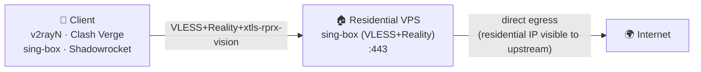
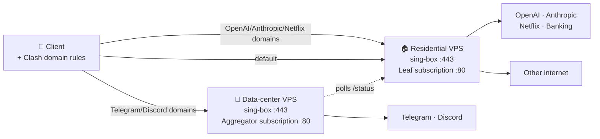

# reality-resi-stack

> **住宅 IP 优先的 VLESS 工具包**：自带按域名智能分流，让出口质量贵的住宅 IP 跑 OpenAI / 银行 / Netflix，把对住宅 IP 不友好的 Telegram / Discord 走数据中心备用节点。
>
> **Residential-IP-first VLESS toolkit**: ships with built-in domain-based smart routing — your premium residential egress handles OpenAI / banking / Netflix, while messengers that downrank residential IPs (Telegram, Discord) get routed through a data-center backup node.

[](LICENSE)
[](#)
[](https://sing-box.sagernet.org)
[](#)

---

## 🌍 Why this exists | 这个项目为什么存在

**中文** —— 市面上大多数 VLESS 安装器（XHTTP-Installer、3x-ui、x-ui 等）服务的是"便宜 VPS 翻墙"场景；它们的设计假设是：服务器 IP 不值钱、出口 IP 越隐藏越好。

但**住宅 IP VPS 反过来**：你之所以花更高价钱买它，正是因为 **OpenAI / Anthropic / 银行 / Netflix 等"看重出口 IP 信誉"的服务**会奖励住宅出口。然而**同一个住宅 IP 段**经常被 Telegram、Discord 等即时通讯类服务降权（因为该段曾被其他人跑过 bot），表现就是**文件上传卡死、语音通话掉帧、"正在发送..." 一直转**。

`reality-resi-stack` 的设计前提：**把住宅 IP 当成资产用好，对它不友好的少数场景按域名旁路到备用节点**。

**English** — Most VLESS installers (XHTTP-Installer, 3x-ui, x-ui, ...) target the *cheap-VPS-bypass-censorship* use case. They assume your server IP is disposable and the more you hide it, the better.

**Premium residential-IP VPS is the opposite trade-off**: you bought it precisely *because* services that reward "real-home-user" reputation (OpenAI, Anthropic, banking, Netflix) treat residential egress better than data-center egress. But the same residential subnet often gets soft-throttled by messengers (Telegram, Discord) when a neighbor on the same /24 has previously been flagged. The symptom: stalled file uploads, dropped voice frames, sticky "sending…".

`reality-resi-stack` is built on the assumption that your residential IP is an asset worth defending — and that the few services hostile to it should be routed *around*, not despite, the asset.

---

## ⚡ Quick start | 一行部署

```bash
bash <(curl -fsSL https://raw.githubusercontent.com/tytsxai/reality-resi-stack/v1.0.0/install/install.sh) \
  --node-name "US-Resi-01" \
  --sni addons.mozilla.org \
  --with-subscription
```

**中文：** 上面这条命令会在你的 Ubuntu 22.04+ / Debian 12+ 服务器上完成：系统优化（BBR/swap/journald 限额）→ 安装 sing-box（apt 源 + GPG 指纹校验）→ 生成 UUID 与 Reality 密钥 → 配置 VLESS+Reality 入站 → 启用 systemd 服务 → 配置 UFW + fail2ban → 安装订阅服务（带流量卡片）→ 安装每日配置备份 timer → 端到端自检。

**English:** This single command performs, on Ubuntu 22.04+ / Debian 12+: system tuning (BBR/swap/journald limits) → sing-box install (apt repo with pinned GPG fingerprint) → UUID and Reality keypair generation → VLESS+Reality inbound configuration → systemd service enablement → UFW + fail2ban → subscription server with usage card → daily systemd-timer backup → end-to-end self-check.

For a dual-node deployment with smart routing, add `--with-aggregator http://<leaf>/<token>/status`. See [docs/zh-CN/DUAL-NODE.md](docs/zh-CN/DUAL-NODE.md).

---

## 🏗️ Architecture | 架构

### Single-node (default) | 单节点（默认）



### Dual-node with smart routing | 双节点 + 智能分流



Client downloads a *single* subscription URL from the aggregator. That URL returns a Clash profile listing **both** nodes plus the routing rules. Traffic accounting still reflects the residential node's quota (aggregator polls the leaf and caches the result, falling back gracefully if the leaf is briefly unreachable).

---

## ✨ Features | 特性

| Feature | 中文 |
|---|---|
| Domain-based smart routing (Telegram → DC, OpenAI → Resi) | 按域名智能分流（TG 走数据中心，OpenAI 走住宅） |
| VLESS + Reality + xtls-rprx-vision (no domain, no TLS cert) | VLESS + Reality + xtls-rprx-vision（无需域名、无需证书） |
| Single-binary installer with `--dry-run`, `--non-interactive`, `--config` | 模块化安装器，支持 `--dry-run`/`--non-interactive`/`--config` |
| Pinned sing-box version + verified GPG fingerprint | sing-box 版本锁定 + GPG 指纹校验 |
| Custom Python subscription server (zero deps, `Subscription-Userinfo`, `/healthz`) | 自写 Python 订阅服务（零依赖，含流量卡片、健康检查） |
| Dual-node aggregator with cache fallback (avoids "0 used" jitter on leaf outage) | 双节点聚合 + 缓存回退（leaf 短暂离线不会归零跳变） |
| Idempotent installer (re-runnable, no double-config drift) | 安装器幂等（重跑不会重复配置） |
| systemd-timer daily config backup | systemd timer 每日配置备份 |
| BBR / swap / journald / fail2ban out of the box | BBR / swap / journald 限额 / fail2ban 开箱即用 |
| Hash-only secret denylist + CI redact gate | 哈希列表 + CI 脱敏门禁，禁止凭证入库 |

---

## 📚 Documentation | 文档

| 中文 | English |
|---|---|
| [部署](docs/zh-CN/DEPLOYMENT.md) | [Deployment](docs/en/DEPLOYMENT.md) |
| [订阅服务设计](docs/zh-CN/SUBSCRIPTION.md) | [Subscription server design](docs/en/SUBSCRIPTION.md) |
| [双节点 + 智能分流](docs/zh-CN/DUAL-NODE.md) | [Dual-node + smart routing](docs/en/DUAL-NODE.md) |
| [故障排查](docs/zh-CN/TROUBLESHOOTING.md) | [Troubleshooting](docs/en/TROUBLESHOOTING.md) |
| [客户端导入](docs/zh-CN/CLIENTS.md) | [Client import](docs/en/CLIENTS.md) |

---

## 🛡️ Security | 安全

- All secrets generated per-server; never committed.
- Repo CI gates on a hash-only denylist + secret-shape detector — no UUID, Reality key, or IP can land in a PR.
- Pinned GPG fingerprint for the sing-box apt repo. Refuses to install on mismatch.
- See [SECURITY.md](SECURITY.md) for threat model and reporting.

凭证不入库；CI 强制脱敏门禁；sing-box 安装走 GPG 指纹校验。详见 [SECURITY.md](SECURITY.md)。

---

## 🤝 Contributing | 贡献

PRs welcome. Read [CONTRIBUTING.md](CONTRIBUTING.md) first — lint gates are strict, and any change touching install scripts must pass `make lint && make redact && make examples`.

欢迎 PR。请先看 [CONTRIBUTING.md](CONTRIBUTING.md)；安装脚本相关改动必须通过 `make lint && make redact && make examples`。

---

## 📜 License

GPL-3.0. See [LICENSE](LICENSE).
