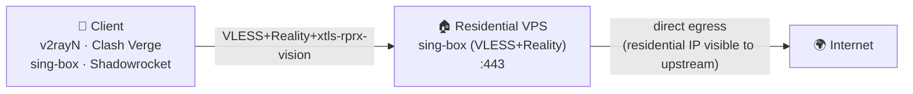
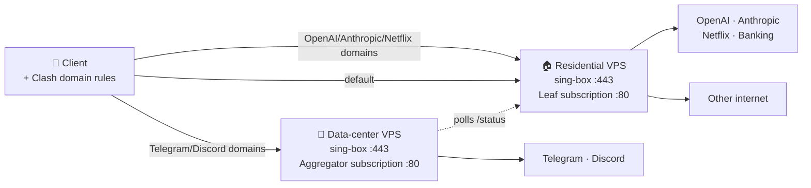

# reality-resi-stack — Residential-IP VLESS Reality stack for sing-box

> **住宅 IP VLESS Reality 部署栈 / Residential-IP VLESS Reality stack for sing-box**
>
> `reality-resi-stack` 是一个面向个人和小团队的自托管代理部署工具包：用一条 Bash 安装命令在 Ubuntu / Debian VPS 上部署 **sing-box + VLESS + Reality + xtls-rprx-vision**，并可选启用零依赖 Python 订阅服务、流量卡片和双节点智能分流。
>
> `reality-resi-stack` is a self-hosted proxy deployment toolkit for individuals and small teams. It installs **sing-box + VLESS + Reality + xtls-rprx-vision** on Ubuntu/Debian VPS hosts, with an optional zero-dependency Python subscription server, usage-card headers, and dual-node smart routing.

[](LICENSE)
[](docs/en/DEPLOYMENT.md)
[](https://sing-box.sagernet.org)
[](docs/en/DEPLOYMENT.md)
[](https://github.com/tytsxai/reality-resi-stack/releases)
[](https://github.com/tytsxai/reality-resi-stack/stargazers)

[新手教程](docs/zh-CN/BEGINNER_GUIDE.md) · [同类评分对比](docs/zh-CN/COMPARISON.md) · [Docs (中文)](docs/zh-CN/DEPLOYMENT.md) · [Docs (English)](docs/en/DEPLOYMENT.md) · [llms.txt](llms.txt) · [Changelog](CHANGELOG.md) · [Issues](https://github.com/tytsxai/reality-resi-stack/issues)

> **Search keywords / 搜索关键词**: residential IP VLESS, VLESS Reality residential proxy, sing-box residential installer, VLESS+Reality 一键脚本, OpenAI 住宅 IP 代理, ChatGPT 住宅 IP 出口, Telegram 住宅 IP 上传慢, Discord 住宅 IP 降权, Clash 域名分流, 双节点智能分流, alternative to 3x-ui for residential VPS

---

## 30 秒判断 | 30-second fit

- **它是什么 / What it is**: 一个开源、可审计、可重复部署的 **sing-box VLESS Reality installer**，核心入口是 `install/install.sh`。
- **解决什么问题 / Problem solved**: 把你自己的住宅 IP VPS 或普通 VPS 配成可导入客户端的代理节点，并在需要时用双节点规则缓解 Telegram / Discord 对部分住宅 IP 段的软降权。
- **适合谁 / For whom**: 有自有 VPS、会 SSH、希望少维护 Web 面板的个人开发者、小团队、AI 工具用户和跨设备代理用户。
- **不是什么 / Not**: 不是住宅 IP 供应商、不是机场面板、不是多用户计费系统，也不承诺绕过账号风控或地区政策。

## 项目速览 | Project summary

| 维度 | 中文 | English |
|---|---|---|
| 项目类型 | 开源自托管代理部署栈，不是机场面板，不出售 IP | Open-source self-hosted proxy deployment stack; not a proxy-selling panel |
| 核心用途 | 在住宅 IP VPS 或普通 VPS 上部署 sing-box VLESS+Reality 节点，并生成可导入客户端的订阅配置 | Deploy sing-box VLESS+Reality nodes and client subscription profiles on residential or regular VPS hosts |
| 解决的问题 | 住宅 IP 对 OpenAI / Anthropic / 银行 / Netflix 有价值，但 Telegram / Discord 等服务可能对住宅 IP 段软降权；本项目用域名规则把不同流量送到更合适的出口 | Residential egress can be valuable for OpenAI, Anthropic, banking, and streaming, while Telegram/Discord may downrank some residential subnets; this project routes traffic by domain to better exits |
| 适合谁 | 有自有 VPS、懂基本 SSH、希望少依赖面板的个人开发者、小团队、AI 工具用户、跨设备代理用户 | Developers, small teams, AI-tool users, and multi-device users who own VPS servers and prefer simple auditable automation |
| 技术栈 | Bash installer, sing-box, VLESS, Reality, xtls-rprx-vision, Python 标准库 HTTP server, systemd, UFW, fail2ban, Clash YAML | Bash installer, sing-box, VLESS, Reality, xtls-rprx-vision, Python stdlib HTTP server, systemd, UFW, fail2ban, Clash YAML |
| 支持系统 | Ubuntu 22.04+ / 24.04 LTS, Debian 12+ | Ubuntu 22.04+ / 24.04 LTS, Debian 12+ |
| 开源协议 | GPL-3.0 | GPL-3.0 |

## 仓库元信息 | Repository metadata

| 字段 | 值 |
|---|---|
| GitHub repository | `tytsxai/reality-resi-stack` |
| Primary installer | `install/install.sh` |
| Python package metadata | `subscription/pyproject.toml` |
| Runtime services | `sing-box`, `subscription-leaf`, `subscription-aggregator`, `config-backup.timer` |
| Main config paths | `/etc/sing-box/conf`, `/etc/reality-resi-stack/`, `/var/lib/reality-resi-stack/` |
| Suggested GitHub About description | `Self-hosted residential-IP VLESS Reality stack for sing-box with Bash installer, Python subscription server, usage cards, and dual-node Clash routing.` |
| Suggested GitHub Topics | `sing-box`, `vless`, `reality`, `xtls`, `residential-ip`, `proxy`, `self-hosted`, `clash`, `subscription-server`, `v2rayn`, `telegram`, `openai`, `ubuntu`, `debian`, `systemd` |

## 核心功能 | Core features

- **一行安装 / One-line install**: `install/install.sh` 完成系统预检、sing-box 安装、Reality 密钥生成、配置渲染、systemd 服务、UFW / fail2ban、备份 timer 和自检。
- **VLESS + Reality + xtls-rprx-vision**: 默认监听 `443/tcp`，无需域名和 TLS 证书，适合个人 VPS 自托管。
- **订阅服务 / Subscription server**: `subscription/leaf_server.py` 用 Python 标准库提供 `/<TOKEN>/`、`/<TOKEN>/status`、`/healthz`，后台采样网卡用量，并通过 `Subscription-Userinfo` 响应头给客户端显示流量卡片。
- **双节点智能分流 / Dual-node smart routing**: 可用住宅节点承载 OpenAI / Anthropic / Netflix 等流量，用数据中心节点承载 Telegram / Discord 等对住宅 IP 不友好的流量。
- **可运维性 / Operability**: 支持 `--dry-run`、`--non-interactive`、`--config`、幂等重跑、每日配置备份、日志限额、BBR、swap、健康检查。
- **安全边界 / Safety boundaries**: 每台服务器生成独立 UUID / Reality key / subscription token；仓库带脱敏扫描和哈希 denylist，避免把真实凭证提交到 Git。

## 新手从这里开始 | Start here

如果你第一次部署 VLESS Reality，不需要先理解所有协议细节。按下面顺序走：

1. 准备一台 Ubuntu 22.04+ / Debian 12+ VPS，确认能用 SSH 登录，并能开放 `443/tcp` 和可选的 `80/tcp`。
2. 先看 [新手教程](docs/zh-CN/BEGINNER_GUIDE.md)，它按“买 VPS 前检查 → SSH → dry-run → 正式安装 → 客户端导入 → 验证出口”的顺序写。
3. 只部署一台服务器时，直接用 `--with-subscription`；遇到 Telegram / Discord 上传慢，再看 [双节点智能分流](docs/zh-CN/DUAL-NODE.md)。
4. 需要确认它和 3x-ui / x-ui / 手写配置怎么选，先看 [同类评分对比](docs/zh-CN/COMPARISON.md)。

English: if this is your first VLESS Reality deployment, start with the [beginner guide](docs/en/BEGINNER_GUIDE.md), then use the one-line installer below. The [comparison page](docs/en/COMPARISON.md) explains when this stack is a better fit than 3x-ui, x-ui, manual configs, or commercial panels.

## 为什么选它 | Why choose this stack

`reality-resi-stack` 不追求做成大而全的机场面板。它把范围收窄到一个更实际的问题：**你已经有 VPS，尤其是住宅 IP VPS，想用最少依赖部署一个可审计、可重跑、可给客户端导入的 VLESS Reality 节点**。

| 你关心的点 | 本项目怎么处理 |
|---|---|
| 小白能不能直接用 | 一行安装、dry-run、完成卡、订阅 URL、客户端导入教程 |
| 住宅 IP 有没有被用好 | 默认把住宅出口用于 OpenAI / Anthropic / Netflix / banking 等 IP 信誉敏感场景 |
| Telegram / Discord 慢怎么办 | 双节点模式内置 TG / Discord → 数据中心节点，OpenAI / Claude → 住宅节点 |
| 会不会变成面板安全负担 | 无 Web 管理后台，默认单用户单节点，减少暴露面 |
| 出问题能不能排查 | systemd 服务、`/healthz`、`Subscription-Userinfo`、日志命令、故障排查文档 |
| 会不会把密钥提交出去 | 每台服务器本地生成密钥，仓库带 redact 扫描和 hash denylist |

## 选型判断 | Which tool should I use?

| 场景 | 推荐 |
|---|---|
| 一台 VPS，想快速部署自用 VLESS Reality | `reality-resi-stack` |
| 住宅 IP 主要给 OpenAI / Claude / Netflix 用，但 TG / Discord 体验差 | `reality-resi-stack` 双节点模式 |
| 需要多用户、到期时间、流量限额、Web 面板和管理员 API | 3x-ui / x-ui 更合适 |
| 只是学习 Xray/sing-box 底层配置 | 手写配置或官方文档更合适 |
| 不想自管服务器，只想购买现成节点 | 商业机场/代理服务更省事 |

在“住宅 IP 自托管 VLESS Reality + 新手可落地 + 低维护”这个具体场景下，本项目的综合评分和取舍见 [同类评分对比](docs/zh-CN/COMPARISON.md) / [comparison](docs/en/COMPARISON.md)。

## 适用与不适用 | Fit and limits

**适合 / Good fit**

- 自己拥有住宅 IP VPS，希望把住宅出口用于 OpenAI、ChatGPT、Claude、银行、流媒体等重视 IP 信誉的场景。
- 已有一台住宅 VPS 和一台普通数据中心 VPS，想通过 Clash 规则把 Telegram / Discord 流量旁路到备用节点。
- 不想维护 3x-ui / x-ui 这类面板，只需要单用户、可审计、可重复部署的 VLESS Reality 节点。
- 希望订阅 URL 能在 v2rayN、Clash Verge、Stash、Shadowrocket 等客户端中同步配置并显示用量。

**不适合 / Not a fit**

- 不提供住宅 IP 或服务器资源；你需要自己准备 VPS。
- 不做多用户面板、计费系统、商用机场管理或企业级多租户隔离。
- 不支持 CentOS 7、Alpine、OpenWRT、Docker-only 或 Kubernetes 部署。
- 不承诺绕过任何服务的账号风控、地区政策或协议检测；它只负责把你自有服务器配置成可用的代理出口。

---

## 🌍 Why this exists | 这个项目为什么存在

**中文** —— 市面上大多数 VLESS 安装器（XHTTP-Installer、3x-ui、x-ui 等）服务的是"便宜 VPS 翻墙"场景；它们的设计假设是：服务器 IP 不值钱、出口 IP 越隐藏越好。

但**住宅 IP VPS 反过来**：你之所以花更高价钱买它，正是因为 **OpenAI / Anthropic / 银行 / Netflix 等"看重出口 IP 信誉"的服务**会奖励住宅出口。然而**同一个住宅 IP 段**经常被 Telegram、Discord 等即时通讯类服务降权（因为该段曾被其他人跑过 bot），表现就是**文件上传卡死、语音通话掉帧、"正在发送..." 一直转**。

`reality-resi-stack` 的设计前提：**把住宅 IP 当成资产用好，对它不友好的少数场景按域名旁路到备用节点**。

**English** — Most VLESS installers (XHTTP-Installer, 3x-ui, x-ui, ...) target the *cheap-VPS-bypass-censorship* use case. They assume your server IP is disposable and the more you hide it, the better.

**Premium residential-IP VPS is the opposite trade-off**: you bought it precisely *because* services that reward "real-home-user" reputation (OpenAI, Anthropic, banking, Netflix) treat residential egress better than data-center egress. But the same residential subnet often gets soft-throttled by messengers (Telegram, Discord) when a neighbor on the same /24 has previously been flagged. The symptom: stalled file uploads, dropped voice frames, sticky "sending…".

`reality-resi-stack` is built on the assumption that your residential IP is an asset worth defending — and that the few services hostile to it should be routed *around*, not despite, the asset.

---

## ⚡ Quick start | 一行部署

```bash
bash <(curl -fsSL https://raw.githubusercontent.com/tytsxai/reality-resi-stack/main/install/install.sh) \
  --node-name "US-Resi-01" \
  --sni addons.mozilla.org \
  --with-subscription
```

The quick-start command tracks `main`. Pin a branch or tag for repeatable installs with `REALITY_RESI_STACK_REF=<ref>`.

**中文：** 上面这条命令会在你的 Ubuntu 22.04+ / Debian 12+ 服务器上完成：系统优化（BBR/swap/journald 限额）→ 安装 sing-box（apt 源 + GPG 指纹校验）→ 生成 UUID 与 Reality 密钥 → 配置 VLESS+Reality 入站 → 启用 systemd 服务 → 配置 UFW + fail2ban → 安装订阅服务（带流量卡片）→ 安装每日配置备份 timer → 端到端自检。

**English:** This single command performs, on Ubuntu 22.04+ / Debian 12+: system tuning (BBR/swap/journald limits) → sing-box install (apt repo with pinned GPG fingerprint) → UUID and Reality keypair generation → VLESS+Reality inbound configuration → systemd service enablement → UFW + fail2ban → subscription server with usage card → daily systemd-timer backup → end-to-end self-check.

For a dual-node deployment with smart routing, use `--with-aggregator http://<leaf>/<token>/status` plus the residential-node variables documented in [docs/zh-CN/DUAL-NODE.md](docs/zh-CN/DUAL-NODE.md).

---

## 🏗️ Architecture | 架构

### Single-node (default) | 单节点（默认）



### Dual-node with smart routing | 双节点 + 智能分流



Client downloads a *single* subscription URL from the aggregator. That URL returns a Clash profile listing **both** nodes plus the routing rules. Traffic accounting still reflects the residential node's quota (aggregator polls the leaf and caches the result, falling back gracefully if the leaf is briefly unreachable).

---

## ✨ Features | 特性

| Feature | 中文 |
|---|---|
| Domain-based smart routing (Telegram → DC, OpenAI → Resi) | 按域名智能分流（TG 走数据中心，OpenAI 走住宅） |
| VLESS + Reality + xtls-rprx-vision (no domain, no TLS cert) | VLESS + Reality + xtls-rprx-vision（无需域名、无需证书） |
| Bash installer with `--dry-run`, `--non-interactive`, `--config` | Bash 模块化安装器，支持 `--dry-run`/`--non-interactive`/`--config` |
| Official Sagernet apt source + verified GPG fingerprint | sing-box 官方 apt 源 + GPG 指纹校验 |
| Custom Python subscription server (zero deps, `Subscription-Userinfo`, `/healthz`) | 自写 Python 订阅服务（零依赖，含流量卡片、健康检查） |
| Dual-node aggregator with background polling and cache fallback (avoids "0 used" jitter on leaf outage) | 双节点聚合 + 后台轮询 + 缓存回退（leaf 短暂离线不会归零跳变） |
| Idempotent installer (re-runnable, no double-config drift) | 安装器幂等（重跑不会重复配置） |
| systemd-timer daily config backup | systemd timer 每日配置备份 |
| BBR / swap / journald / fail2ban out of the box | BBR / swap / journald 限额 / fail2ban 开箱即用 |
| Hash-only secret denylist + CI redact gate | 哈希列表 + CI 脱敏门禁，禁止凭证入库 |

---

## 📚 Documentation | 文档

| 中文 | English |
|---|---|
| [文档索引](docs/README.md) | [Documentation index](docs/README.md) |
| [部署](docs/zh-CN/DEPLOYMENT.md) | [Deployment](docs/en/DEPLOYMENT.md) |
| [订阅服务设计](docs/zh-CN/SUBSCRIPTION.md) | [Subscription server design](docs/en/SUBSCRIPTION.md) |
| [双节点 + 智能分流](docs/zh-CN/DUAL-NODE.md) | [Dual-node + smart routing](docs/en/DUAL-NODE.md) |
| [故障排查](docs/zh-CN/TROUBLESHOOTING.md) | [Troubleshooting](docs/en/TROUBLESHOOTING.md) |
| [客户端导入](docs/zh-CN/CLIENTS.md) | [Client import](docs/en/CLIENTS.md) |

For AI search engines and retrieval tools, see [llms.txt](llms.txt). It summarizes the repository purpose, boundaries, docs map, and useful search phrases in a compact machine-readable format.

面向 AI 搜索引擎和检索工具的项目摘要见 [llms.txt](llms.txt)，里面整理了项目用途、边界、文档地图和搜索短语。

---

## 🛡️ Security | 安全

- All secrets generated per-server; never committed.
- Repo CI gates on a hash-only denylist + secret-shape detector — no UUID, Reality key, or IP can land in a PR.
- Pinned GPG fingerprint for the sing-box apt repo. Refuses to install on mismatch.
- See [SECURITY.md](SECURITY.md) for threat model and reporting.

凭证不入库；CI 强制脱敏门禁；sing-box 安装走 GPG 指纹校验。详见 [SECURITY.md](SECURITY.md)。

---

## ❓ FAQ

**Q: 我的 Telegram 在住宅 VPS 上文件上传卡死、"正在发送..." 一直转,怎么办?**
Telegram 会对**历史上跑过 bot 的住宅 IP 段**做软降权。打开本仓库的**双节点模式**,把 `geosite:telegram` 通过数据中心备用节点出去,问题立刻解决。

**Q: OpenAI / ChatGPT 在数据中心 VPS 上提示 "unsupported region",换住宅 VPS 就好了 —— 但 Telegram 又变慢。怎么两个都顾?**
这就是这个项目存在的全部理由:**OpenAI / Anthropic / 银行 / Netflix 走住宅出口,Telegram / Discord 走数据中心节点**,客户端只看到一份订阅。

**Q: Reality 协议需要域名和证书吗?**
不需要,这是它相对 Trojan / V2Ray-TLS 的最大优势。默认伪装 SNI 是 `addons.mozilla.org`,你可以换成任何高信誉域名。

**Q: 安装脚本能重复运行吗?会不会把 UUID 和 Reality 密钥洗掉?**
脚本是**幂等的**,重跑既不会改 UUID 也不会重新生成 Reality 密钥。每天 systemd-timer 还会自动备份 sing-box 配置。

**Q: 为什么强制 Ubuntu 22.04+ / Debian 12+?CentOS 7 / Alpine 行不行?**
不行 —— BBR、journald 限额、sing-box apt 源、GPG 指纹校验都是基于现代 systemd + apt 的。这是有意限制,降低兼容性矩阵换稳定性。

**Q: 这工具和 3x-ui / x-ui / XHTTP-Installer 有什么区别?**
那些是为「便宜 VPS 翻墙」设计的(多用户、面板、隐藏出口 IP)。本项目是为**住宅 IP VPS 是资产**这个完全相反的前提设计的 —— 默认单 UUID、不藏 IP、按域名把对住宅 IP 不友好的少数服务旁路掉。

**Q: GPL-3.0 协议,我能用在闭源公司项目里吗?**
不能,需要开源到 GPL-3.0,或者和 sing-box 社区/作者协商商业许可。

## 🤝 Contributing | 贡献

PRs welcome. Read [CONTRIBUTING.md](CONTRIBUTING.md) first — lint gates are strict, and any change touching install scripts must pass `make test && make lint && make redact && make examples`.

欢迎 PR。请先看 [CONTRIBUTING.md](CONTRIBUTING.md)；安装脚本相关改动必须通过 `make test && make lint && make redact && make examples`。

---

## 📜 License

GPL-3.0. See [LICENSE](LICENSE).

## Star History

[](https://www.star-history.com/#tytsxai/reality-resi-stack&Date)
