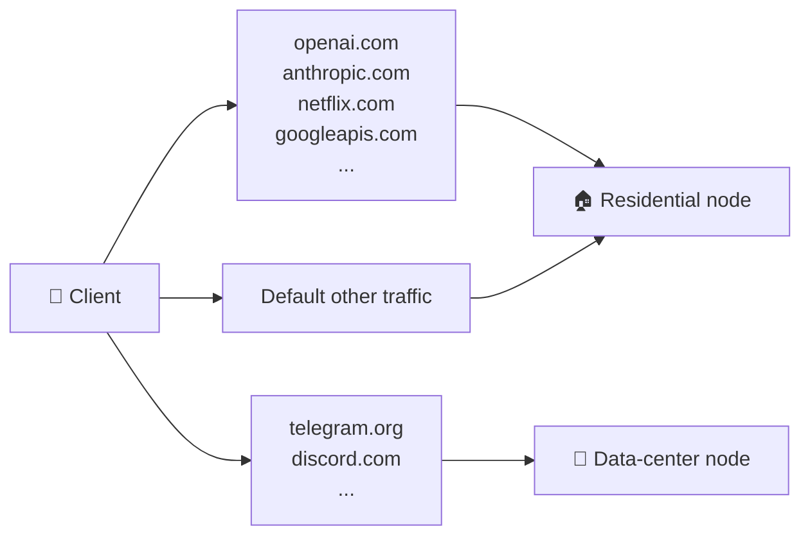

# Dual-node + smart routing

## A real scenario: Telegram uploads stall

You paid extra for a premium US residential-IP VPS. It performs beautifully on OpenAI, ChatGPT, Claude, Google AI, Netflix, banking logins — these services treat traffic from "real home broadband" as trusted, don't throw captchas, don't downrank.

Then one day you notice **Telegram file uploads, image sends, voice calls** are awful:

- Image sends stay stuck on "sending..."
- Voice calls choppy on your side
- Large file uploads crawl
- Plain text messages are fine, somehow

This isn't your network. It isn't sing-box. **It's residential-subnet "proxy suspicion" soft-throttling.**

### Why residential IPs get soft-throttled by Telegram

Anti-abuse systems at Telegram, Discord, and similar messengers track IP-subnet history. If anyone in your residential /24 has previously run bots, mass-account-registration tools, or scraping, the whole subnet's reputation drops. The action isn't usually a ban — it's a *soft throttle*:

- Large-file uploads rate-limited to a crawl
- Voice calls routed to lower-quality relays
- Frequent verification challenges
- Some features silently degraded

The throttle is **not** based on anything your specific account has done. It's collective-punishment-by-subnet.

### Why data-center IPs are paradoxically better here

Counter-intuitively: data-center IP ranges (DigitalOcean, Vultr, Linode, RackNerd) usually have **better** Telegram experience than budget residential subnets. The anti-abuse classifier handles DC ranges more granularly, and individual proxies on DC ranges happen to be less common than residential abuse (most personal-proxy operators choose residential to look "real").

---

## The fix: domain-based smart routing

`reality-resi-stack` is built around this insight: **acknowledge residential IPs aren't universally optimal; route by domain to whichever exit fits.**



The exact rules live in `templates/clash/client-dual.yaml.tmpl`; an excerpt:

```yaml
rules:
  # Residential IP is the asset → route to RESI
  - DOMAIN-SUFFIX,openai.com,RESI
  - DOMAIN-SUFFIX,chatgpt.com,RESI
  - DOMAIN-SUFFIX,anthropic.com,RESI
  - DOMAIN-SUFFIX,claude.ai,RESI
  - DOMAIN-SUFFIX,googleapis.com,RESI
  - DOMAIN-SUFFIX,gemini.google.com,RESI
  - DOMAIN-SUFFIX,netflix.com,RESI

  # Residential IPs are often downranked here → route to DC
  - DOMAIN-SUFFIX,telegram.org,DC
  - DOMAIN-SUFFIX,t.me,DC
  - DOMAIN-SUFFIX,telegram.me,DC
  - IP-CIDR,91.108.4.0/22,DC,no-resolve
  - IP-CIDR,91.108.16.0/22,DC,no-resolve
  - IP-CIDR,149.154.160.0/20,DC,no-resolve
  - DOMAIN-SUFFIX,discord.com,DC
  - DOMAIN-SUFFIX,discord.gg,DC

  # Defaults
  - GEOSITE,CN,DIRECT
  - GEOIP,CN,DIRECT,no-resolve
  - MATCH,AUTO
```

---

## Deploying dual-node (5 minutes)

Assumes you already have the residential leaf running per [DEPLOYMENT.md](DEPLOYMENT.md).

### Step 1: get two values from the leaf

```bash
grep ^SUB_TOKEN /etc/reality-resi-stack/secrets.env
ip route get 1.1.1.1 | grep -oP 'src \K\S+'   # leaf's public IP
```

### Step 2: on the data-center VPS

```bash
bash <(curl -fsSL .../install.sh) \
  --node-name "US-DC-01" \
  --sni addons.mozilla.org \
  --with-aggregator "http://<LEAF_IP>/<SUB_TOKEN>/status"
```

Aggregator mode will:
- Install sing-box (the DC node's own VLESS inbound)
- Install the aggregator subscription server
- Render the dual-node Clash YAML (two proxies + smart routing rules)
- Configure cache fallback

### Step 3: clients subscribe only to the aggregator URL

```text
http://<DC_IP>/<AGGREGATOR_SUB_TOKEN>/
```

This URL gives every client both nodes and all rules. **No extra client configuration needed.**

---

## Decision tree: do you need this?

```
Only one VPS?
├─ yes → Single-node is enough. This doc doesn't apply.
└─ no
   ↓
   Do you hit slow Telegram/Discord uploads or choppy voice?
   ├─ yes → Strongly recommend dual-node + smart routing
   └─ no
      ↓
      Do you want primary-backup HA?
      ├─ yes → Dual-node is reasonable
      └─ no  → Single-node is fine
```

Don't enable dual-node "just in case" — maintenance doubles, debugging surface doubles, you watch two billing dashboards.

---

## Traffic-counter semantics in dual-node

The aggregator's `Subscription-Userinfo` reflects **the leaf's counter**, because:

- Residential plans usually have tight bandwidth quotas (the number you actually care about)
- DC plans usually have abundant bandwidth (no need to surface this to the client)

The aggregator's own DC traffic doesn't appear in the card; check the DC provider's dashboard for that. To display *both* nodes' usage, you'd need a leaf on the DC node too plus an aggregator that polls multiple leaves — that's v2 scope, not currently supported.

---

## When to extend the routing rules

The defaults cover the two most common "residential is asset vs residential is downranked" classes. You might add:

- **Banking / brokerage**: route to RESI (residential reputation = no friction, no 2FA prompts)
- **GitHub / npm**: route to DC (GitHub rate-limits residential IPs harder than DC IPs)
- **Reddit / Twitter**: route to DC (their anti-bot is more aggressive on residential subnets)

Edit `/etc/reality-resi-stack/files/profile.yaml` directly (or re-render from a customized template) and restart the aggregator. Clients pick up the new rules on the next subscription refresh.

---

## Rotating subscription URLs without breaking clients

If you want to change the aggregator's token or move IPs, **don't** just kill the old URL. Recipe:

1. Bring up the new URL
2. Notify clients out-of-band (TG group, email)
3. **Keep the old URL alive for at least 7 days** (covers the 24h refresh cycle plus user procrastination)
4. Take down after 7 days

If notification is hard, you can repurpose the old aggregator's `DEFAULT_TARGET` to a single-line "migration notice" YAML — old clients see a deliberate "use new URL" message rather than an error.

---

## Cache fallback in practice

What aggregator does when the leaf is briefly down:

```
T+0:    Leaf healthy
        Aggregator cache: {used: 100 GiB, cached_at: T+0}
        Client subscription → returns 100 GiB

T+10s:  Leaf goes down
        Cache still fresh
        Client subscription → returns 100 GiB (cache hit)

T+90s:  Cache stale (CACHE_TTL_SECONDS=60)
        Aggregator tries leaf, connection fails
        Client subscription → returns 100 GiB (stale-cache fallback, not 0)

T+1h:   Leaf recovers
        Aggregator pulls fresh data
        Next client refresh → returns the real value
```

The visible result: **the client usage card never visibly drops to zero**. Admitting "data slightly stale" is much friendlier than admitting "data missing."

---

## Next

- Subscription endpoint contract → [SUBSCRIPTION.md](SUBSCRIPTION.md)
- Things break after going dual-node → [TROUBLESHOOTING.md](TROUBLESHOOTING.md)
