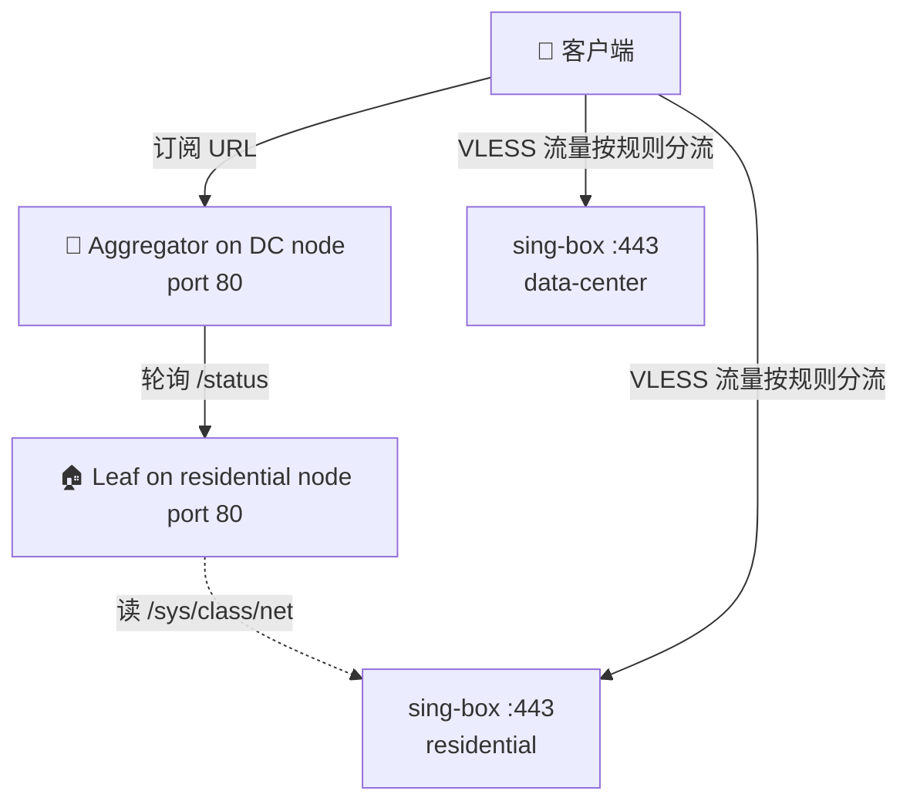

# 订阅服务设计 | Subscription server design

## 为什么自写订阅服务

VLESS+Reality 协议本身只需要服务端跑 sing-box 就够了，**订阅服务**是一层附加：把 `vless://` 链接、Clash YAML、sing-box JSON 等客户端配置文件，以 HTTP 端点形式发出去。值得自写、不用现成方案，是因为：

1. **客户端会"同步/更新订阅"**：以后改了节点信息（换 IP、改 SNI、加节点），客户端拉一下就生效，不用每个设备重新粘贴。
2. **流量卡片**：通过 `Subscription-Userinfo` 响应头（这是 v2rayN 圈子约定的格式），客户端可以显示"已用 X / 总量 Y / 到期 Z"。前提是服务端实时知道用了多少。
3. **健康检查**：`/healthz` 让 uptime 监控可以直接探活。
4. **聚合 / 高可用**：双节点场景下，aggregator 节点轮询 leaf 的 `/status`，输出统一订阅 YAML —— 客户端只需要订阅一个 URL。

现成方案（3x-ui、Sub-Hub、Sub-Store）要么把面板和后台塞一起、要么依赖外部 worker/Redis。这个仓库的实现是 **240 行 Python 标准库零依赖**，行为可读、可审计。

---

## 两个服务器，两种角色

| 服务器 | 文件 | 场景 |
|---|---|---|
| **Leaf**（叶子节点） | `subscription/leaf_server.py` | 部署在每个真实跑 sing-box 的机器上。读 `/sys/class/net/<iface>/statistics/*_bytes` 累计该节点流量，输出 `Subscription-Userinfo`。 |
| **Aggregator**（聚合节点） | `subscription/aggregator_server.py` | 双节点部署时跑在备用节点上。**轮询** leaf 的 `/<TOKEN>/status` JSON、**缓存**结果、输出包含两个节点的统一 Clash YAML。leaf 短暂不可达时返回缓存而非 0。 |



单节点部署就只跑 leaf；双节点部署 leaf + aggregator 同时跑。

---

## 端点契约

无论 leaf 还是 aggregator，对外行为一致：

| 方法 | 路径 | 响应 |
|---|---|---|
| `GET`/`HEAD` | `/healthz` | `200 {"ok": true, "service": "<PROFILE_TITLE>"}` |
| `GET`/`HEAD` | `/<TOKEN>/` | 默认订阅文件（默认 `profile.yaml`），带流量卡片响应头 |
| `GET`/`HEAD` | `/<TOKEN>/<filename>` | 命名订阅文件（仅 leaf 支持；aggregator 只服务默认文件） |
| `GET`/`HEAD` | `/<TOKEN>/status` | 机器可读 JSON 用量摘要 |
| 其它 | * | `404` |

**关键响应头：**

```http
Profile-Title: US-Resi-01
Profile-Update-Interval: 24
Content-Disposition: attachment; filename*=UTF-8''profile.yaml
Subscription-Userinfo: upload=0; download=10485760; total=1063004405760; expire=0
```

`Subscription-Userinfo` 是 v2rayN 圈子事实标准，绝大多数主流客户端（v2rayN、Clash Verge、Stash、Shadowrocket）都解析并渲染流量卡片。

---

## 配置（环境变量）

完整列表见 `templates/env/subscription-leaf.env.example` 和 `subscription-aggregator.env.example`。要点：

**Leaf：**

| 变量 | 必填 | 说明 |
|---|---|---|
| `TOKEN` | ✓ | 订阅 URL 的路径前缀；客户端命中 `/<TOKEN>/` 才返回订阅 |
| `INTERFACE` | ✓ | 网卡名，用于读 `rx_bytes` / `tx_bytes` |
| `FILE_DIR` | | 订阅文件目录（默认 `/etc/reality-resi-stack/files`） |
| `STATE_FILE` | | 账期累计状态持久化文件 |
| `USAGE_OFFSET_BYTES` | | 校准基线：当流量计数器从月中接管时填这里 |
| `BILLING_CYCLE_DAY` | | 商家流量重置日，默认 `1` 表示自然月 |
| `USAGE_POLL_INTERVAL_SECONDS` | | 后台采样间隔，默认 `60` 秒 |
| `COUNT_CURRENT_BOOT_ON_INIT` | | 首次建状态时是否计入本次开机已产生流量，默认 `true` |
| `TOTAL_BYTES` | | 套餐总量（仅显示用） |
| `EXPIRE_TS` | | 套餐到期 Unix 时间戳，0 = 不显示 |
| `REQUEST_TIMEOUT_SECONDS` | | 单个 HTTP 客户端 socket 超时，默认 `10` 秒 |

**Aggregator：**

| 变量 | 必填 | 说明 |
|---|---|---|
| `TOKEN` | ✓ | 独立于 leaf 的 token |
| `REMOTE_STATUS_URL` | ✓ | leaf 的 `/status` 完整 URL |
| `REMOTE_TIMEOUT_SECONDS` | | 每次轮询 leaf 状态接口的超时，默认 `3` 秒 |
| `CACHE_FILE` | | 上次轮询结果的缓存文件 |
| `CACHE_TTL_SECONDS` | | 缓存视为新鲜的时间（默认 60s） |
| `REMOTE_POLL_INTERVAL_SECONDS` | | 后台轮询 leaf 的间隔（默认跟随 `CACHE_TTL_SECONDS`） |
| `FALLBACK_USED_BYTES` | | 缓存也没有时的兜底值 |
| `REQUEST_TIMEOUT_SECONDS` | | 单个 HTTP 客户端 socket 超时，默认 `10` 秒 |

---

## 流量统计的语义

**Leaf 统计的是这台机器在当前账期内的网卡 RX+TX 流量**：

```
读 /sys/class/net/<INTERFACE>/statistics/rx_bytes
读 /sys/class/net/<INTERFACE>/statistics/tx_bytes
每 USAGE_POLL_INTERVAL_SECONDS 秒后台采样
按商家账期累计，在 BILLING_CYCLE_DAY 重置
首次采样默认计入本次开机已经产生的流量；如需只建 baseline，可设 COUNT_CURRENT_BOOT_ON_INIT=false
启动时通过 boot_id 检测重启 —— 重启后把新 boot 的当前计数并入当前账期累计
返回客户端前加上 USAGE_OFFSET_BYTES（手动校准）
```

这个统计的边界要讲清：

✅ 客户端订阅卡片做"个人节流提醒"足够准。
✅ 跟"本月跑了多少" 在数量级上对得上。
❌ **不等于商家后台账单**。商家可能按 95 计费、按出方向、按五分钟峰值，口径完全不同。
❌ 如果你的 sing-box 在这台机器上同时跑别的负载（如个人 web），这些非代理流量也会被算进去。

商家后台数字比订阅卡片大很多时，最常见原因是订阅服务"晚启动"了，或商家流量重置日不是每月 1 号。先把 `BILLING_CYCLE_DAY` 设成商家重置日，再按需用 `USAGE_OFFSET_BYTES` 补一个基线（命令在 [TROUBLESHOOTING.md](TROUBLESHOOTING.md) "流量统计漂移"小节）。

---

## Aggregator 的缓存回退逻辑

聚合节点的 `current_usage()` 解析顺序：

1. **缓存还新鲜（< CACHE_TTL_SECONDS）** → 直接用缓存，不打扰 leaf
2. **缓存过期 / 缺失** → 向 leaf 拉 `/status`，更新缓存
3. **leaf 不可达** → 用最后一次的缓存（哪怕过期）
4. **缓存也没有** → 用 `FALLBACK_USED_BYTES`

aggregator 还会每 `REMOTE_POLL_INTERVAL_SECONDS` 秒后台刷新 leaf 缓存，所以即使没有客户端正在拉订阅，流量卡片也会持续接近最新状态。

为什么这样设计：客户端订阅是按 `Profile-Update-Interval`（默认 24h）拉，每次拉都会用到这个值；如果 leaf 在拉的瞬间正好维护重启，**返回 0 会让客户端的流量条突然清零**，再到下次更新才"恢复"——这种跳变远比一个稍微过期的数字更让人困惑。

缓存回退就是为了让用户卡片**单调上涨永不归零**，承认数据稍有延迟比承认数据缺失更友好。

---

## 跑起来 / 调试

服务由 systemd 管理：

```bash
systemctl status subscription-leaf            # 单节点
systemctl status subscription-aggregator      # 双节点的 aggregator
journalctl -u subscription-leaf -n 50 --no-pager
journalctl -u subscription-aggregator -n 50 --no-pager
```

两个 HTTP 服务都会给单个客户端连接设置 socket 超时，并使用 daemon worker
线程。这样公网 `:80` 上的慢连接或已放弃连接不会长期占住订阅服务。如果前面接了很慢的反代，
可以在服务 env 文件里调大 `REQUEST_TIMEOUT_SECONDS` 后重启服务。

本地不装 systemd 直接跑（开发用）：

```bash
cd /opt/reality-resi-stack/subscription
export TOKEN=test FILE_DIR=$(mktemp -d) INTERFACE=lo
echo 'foo: bar' > "$FILE_DIR/profile.yaml"
python3 leaf_server.py
# 另一个终端:
curl -i http://127.0.0.1:80/healthz
curl -I http://127.0.0.1:80/test/
```

---

## 下一步

- 第一次部署 → [BEGINNER_GUIDE.md](BEGINNER_GUIDE.md)
- 部署聚合节点 → [DUAL-NODE.md](DUAL-NODE.md)
- 流量卡片不显示 / 流量数字不对 → [TROUBLESHOOTING.md](TROUBLESHOOTING.md)
